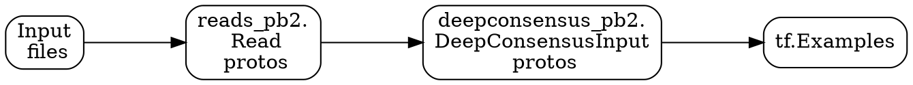
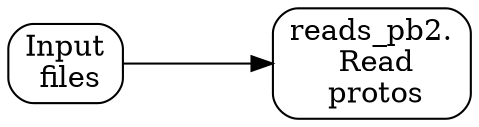
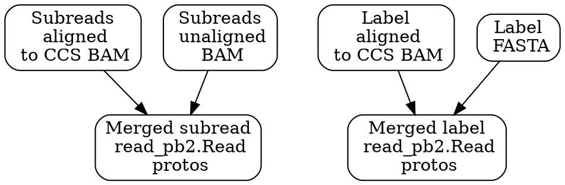
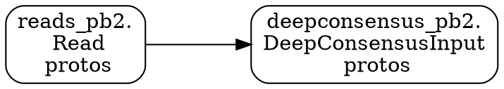
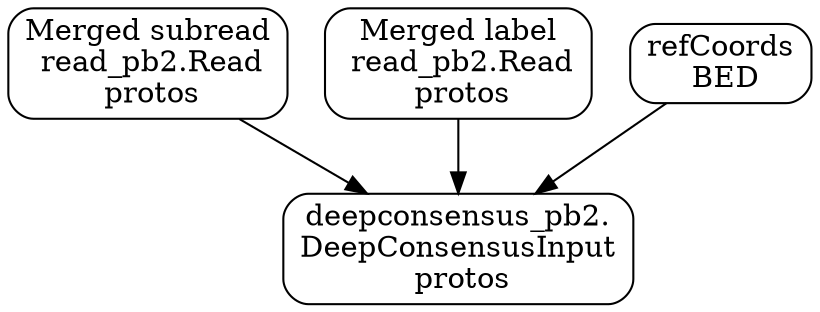

# DeepConsensus Preprocessing

The preprocessing steps for DeepConsensus include several different Beam
pipelines. The preprocess directory contains pipelines that can be used to
convert input BAM/FASTA/BED files into a set of
`deepconsensus_pb2.DeepConsensusInput` protos. These protos can then be
transformed into `tf.Examples`, which will be used for training models. For
details on the pipeline that converts `deepconsensus_pb2.DeepConsensusInput`
protos to `tf.Examples`, see [the tf_examples README](http://go/dc-tf-examples).

[TOC]

## Overview

Below are the steps for processing the native genomics file into
DeepConsensusInput protos. DeepConsensusInput protos can then be transformed
into tf.Examples.



## Pipeline: Merge Datasets

This pipeline merges input genomics files (BAM, FASTA) into two sets of
reads_pb2.Read protos, corresponding to subreads and labels.

### Pipeline Overview



### Pipeline Details



### Input Files

Unless a command is specified below, the input file was given to us by PacBio.
See
[this README](https://cnsviewer2.corp.google.com/cns/is-d/home/brain-genomics/deepvariant/dnanexus_pacbio/NDA/PacBioCCS/ecoli/README.shared.txt)
for a description of the files shared by PacBio.

*   `input_bam` - Aligned subreads BAM. Currently, we are using the BAM
    containing subreads aligned to CCS.
*   `input_unaligned_bam` - Unaligned subreads BAM. This file contains pulse
    width (PW), interpulse distance (IP), and signal to noise ratio (SN) values,
    which are not present in the aligned `input_bam`. The unaligned subreads BAM
    and aligned subreads BAM will be joined together to produce a unified set of
    `reads_pb2.Read` protos.
*   `input_truth_bam` - Aligned truth BAM. Currently, we are using the BAM
    containing truth aligned to CCS. These BAM files did not come from PacBio
    and were generated using a command such as the following:

```
minimap2 -t 16 -a -L -O 5,56 -E 4,1 -B 5 -z 400,50 -N 1000 -p 0.9 /brain-genomics/deepvariant/dnanexus_pacbio/NDA/PacBioCCS/ecoli/ccs/m54316_180808_005743.ccs.bam.fa.gz /brain-genomics/deepvariant/dnanexus_pacbio/NDA/PacBioCCS/ecoli/truth/m54316_180808_005743.truth.fasta.gz
```

*   `input_truth_fasta` - FASTA file containing truth sequences from the
    reference genome. Secondary alignments in `input_truth_bam` are missing the
    original sequence, which can be found in this FASTA. The aligned truth BAM
    and truth FASTA are joined to produce a unified set of `reads_pb2.Read`
    protos.

### Example Usage

```
DATE=$(TZ=US/Pacific date "+%Y%m%d")
INPUT_BAM=/cns/is-d/home/brain-genomics/deepvariant/dnanexus_pacbio/NDA/PacBioCCS/ecoli/subreadsToCcs/m54316_180808_005743.subreadsToCcs.bam
INPUT_UNALIGNED_BAM=/cns/is-d/home/brain-genomics/deepvariant/dnanexus_pacbio/NDA/PacBioCCS/ecoli/subreads/m54316_180808_005743.subreads.bam
input_label_bam=/cns/is-d/home/brain-genomics/deepvariant/dnanexus_pacbio/NDA/PacBioCCS/ecoli/truth/m54316_180808_005743.truth_aligned_to_ccs.sorted.bam
input_label_fasta=/cns/is-d/home/brain-genomics/deepvariant/dnanexus_pacbio/NDA/PacBioCCS/ecoli/truth/m54316_180808_005743.truth.fasta.gz
OUTPUT_PATH=/cns/is-d/home/brain-genomics/${USER}/deepconsensus/merged_datasets/${DATE}

time blaze run -c opt \
//learning/genomics/deepconsensus/preprocess:merge_datasets.par -- \
  --input_bam ${INPUT_BAM} \
  --input_unaligned_bam ${INPUT_UNALIGNED_BAM} \
  --input_label_bam ${input_label_bam} \
  --input_label_fasta ${input_label_fasta} \
  --output_path ${OUTPUT_PATH} \
  --flume_exec_mode=BORG \
  --flume_borg_user_name=${USER} \
  --flume_borg_accounting_charged_user_name=brain-genomics \
  --flume_batch_scheduler_strategy=RUN_SOON \
  --flume_use_batch_scheduler \
  --flume_worker_priority=100 \
  --flume_close_to_resources="/cns/is-d/home/brain-genomics" \
  --flume_backend=DAX \
  --flume_auto_retry=false \
  --flume_tmp_file_cells="is-d" \
  --flume_tmp_dir_group="brain-genomics" \
  --logtostderr \
  --flume_completion_email_address=${USER}@google.com
```

## Pipeline: Generate Input

This pipeline processes and aligns reads_pb2.Read protos to produce
deepconsensus_pb2.DeepConsensusInput protos.

### Pipeline Overview



### Pipeline Details



### Example Usage

```
DATE=$(TZ=US/Pacific date "+%Y%m%d")
MERGED_DATASETS_PATH=/cns/is-d/home/brain-genomics/gunjanbaid/deepconsensus/merged_datasets/20200113
INPUT_BED=/cns/is-d/home/brain-genomics/deepvariant/dnanexus_pacbio/NDA/PacBioCCS/ecoli/refCoords/ecoliK12_pbi_August2018.m54316_180808_005743.ccs.bed
OUTPUT_PATH=/cns/is-d/home/brain-genomics/${USER}/deepconsensus/dc_input_datasets/${DATE}

time blaze run -c opt \
//learning/genomics/deepconsensus/preprocess:generate_input.par -- \
  --merged_datasets_path ${MERGED_DATASETS_PATH} \
  --input_bed ${INPUT_BED} \
  --output_path ${OUTPUT_PATH} \
  --flume_exec_mode=BORG \
  --flume_borg_user_name=${USER} \
  --flume_borg_accounting_charged_user_name=brain-genomics \
  --flume_batch_scheduler_strategy=RUN_SOON \
  --flume_use_batch_scheduler \
  --flume_worker_priority=100 \
  --flume_close_to_resources="/cns/is-d/home/brain-genomics" \
  --flume_backend=DAX \
  --flume_auto_retry=false \
  --flume_tmp_file_cells="is-d" \
  --flume_tmp_dir_group="brain-genomics" \
  --logtostderr \
  --flume_completion_email_address=${USER}@google.com
```
