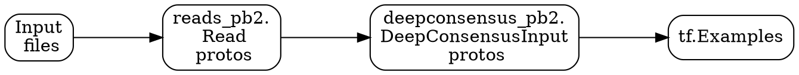
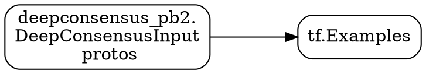
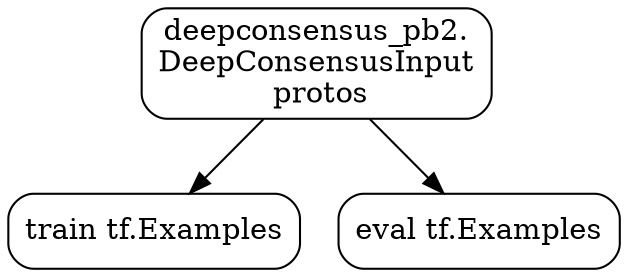

# DeepConsensus tf.Examples

The preprocessing steps for DeepConsensus include several different Beam
pipelines. This directory contains pipelines that can be used to transform
deepconsensus_pb2.DeepConsensusInput protos into tf.Examples, which will be used
for training models. See [the preprocessing README](../preprocess/README.md) for
details on how the DeepConsensusInput protos were generated.

[TOC]

## Overview

Below are the steps for processing the native genomics file into
DeepConsensusInput protos. DeepConsensusInput protos can then be transformed
into tf.Examples.



## Pipeline: Write tf.Examples

This pipeline converts DeepConsensusInput protos into tf.Examples.

### Pipeline Overview



### Pipeline Details



### Arguments

Below are some of the arguments for this pipeline. See
[the code](https://cs.corp.google.com/piper///depot/google3/learning/genomics/deepconsensus/tf_examples/write_tf_examples.py)
for the full list of arguments.

*   `max_passes` - The maximum number of subreads to include. For a given
    config, the example height will be a function will be a function of
    `max_passes` and the features used.
*   `example_width` - Width of the window that will be fed into networks.
    Currently, windows are nonoverlapping.
*   `eval_fraction` - The proportion of examples that will be written to the
    eval set.
*   `chromosome_size` - The size of the chromosome (# bases) and `eval_fraction`
    will be used to determine the cutoff for end positions in the training and
    eval sets. Examples will be split into training and eval sets based on
    molecule end position.

### Example Usage

```
DATE=$(TZ=US/Pacific date "+%Y%m%d")
DEEPCONSENSUS_INPUT_PATH=/cns/is-d/home/brain-genomics/gunjanbaid/deepconsensus/dc_input_datasets/20200113
OUTPUT_PATH=/cns/is-d/home/brain-genomics/${USER}/deepconsensus/tfexamples/${DATE}
EXAMPLE_WIDTH=100
MAX_PASSES=30

time blaze run -c opt \
//learning/genomics/deepconsensus/tf_examples:write_tf_examples.par -- \
  --preprocess_paths ${DEEPCONSENSUS_INPUT_PATH} \
  --preprocess_downsample 1.0 \
  --output_path ${OUTPUT_PATH} \
  --example_width ${EXAMPLE_WIDTH} \
  --max_passes ${MAX_PASSES} \
  --flume_exec_mode=BORG \
  --flume_borg_user_name=${USER} \
  --flume_borg_accounting_charged_user_name=brain-genomics \
  --flume_batch_scheduler_strategy=RUN_SOON \
  --flume_use_batch_scheduler \
  --flume_worker_priority=100 \
  --flume_close_to_resources="/cns/is-d/home/brain-genomics" \
  --flume_backend=DAX \
  --flume_auto_retry=false \
  --flume_tmp_file_cells="is-d" \
  --flume_tmp_dir_group="brain-genomics" \
  --logtostderr \
  --flume_completion_email_address=${USER}@google.com
```
