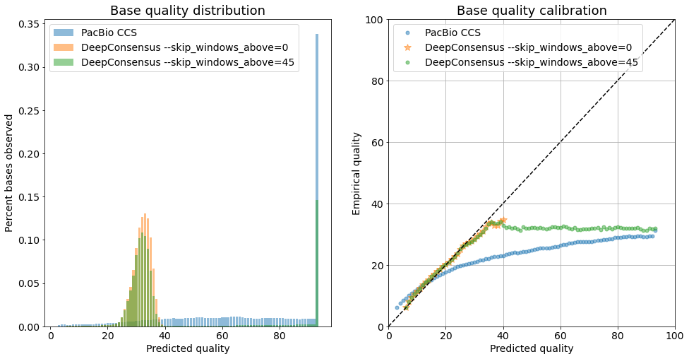

# Empirical versus predicted quality

Here we provide a comparison between empirical base qualities and predicted base
qualities output by DeepConsensus. The predicted base qualities should ideally
reflect the true probability of the base being incorrect. In order to quantify
this, we plot a calibration curve with predicted qualities, as output by the
model, versus empirical qualities, as observed from the data (when labels are
available).

*   Empirical quality refers to the observed quality at any given predicted
    quality. Here, we aligned all the reads to CHM13 and
    [counted](https://github.com/google/deepconsensus/blob/main/deepconsensus/quality_calibration/calculate_baseq_calibration.py)
    how many times we observe correct and incorrect bases at a given predicted
    base quality. From this, we calculated the phred score to obtain the
    empirical quality.

*   Predicted quality refers to the probability output of DeepConsensus or CCS
    associated with each base, which represents the model's confidence in the
    prediction. This is converted to a base quality score (e.g. probability of
    0.99 corresponds to Q20).

This plot quantifies how well calibrated DeepConsensus is as measured on the
`m64062_190806_063919-chr19` dataset (CHM13, chr19 held out from training).

We observe that especially with `--skip_windows_above=0`, which runs
DeepConsensus on all windows the model appears to be well-calibrated.

