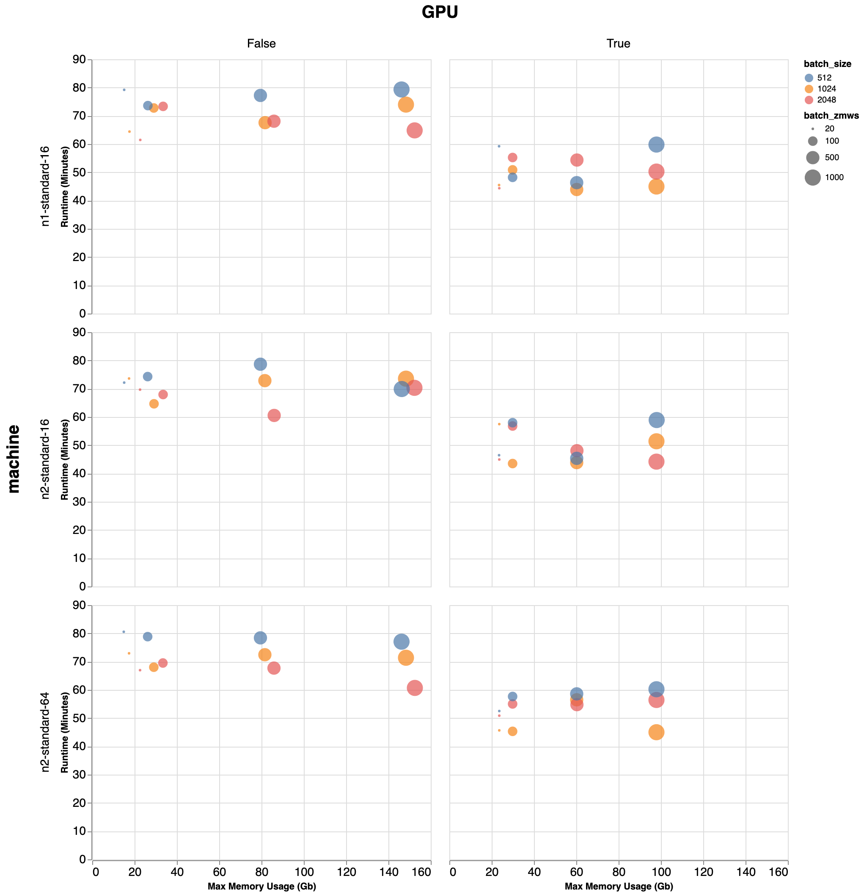

# Runtime on different hardware configurations

## Recommendations

The recommended compute setup for DeepConsensus is to shard each SMRT Cell into
at least 500 shards, each of which can run on a 16-CPU machine (or smaller). We
find that having more than 16 CPUs available for each shard does not
significantly improve runtime. Additionally, for DC v1.2 running with
`--batch_size=2048 --batch_zmws=1000` is a reasonable setup for minimizing
memory requirements while still achieving the best runtime. If you find that
this exhausts the memory on your machines though, reducing both, e.g. to
`--batch_size=1024 --batch_zmws=20` would be a good thing to try.

See the [yield metrics page](yield_metrics.md) for total runtimes on full SMRT
Cells of different sequencing runs.

## Testing runtime on different hardware configurations

We processed 10,000 ZMWs with `ccs` and `actc`. After filtering, we were left
with 3,577 ZMWs, which we used to profile runtimes using `deepconsensus run`
across several hardware configurations. These estimates only reflect the runtime
required to perform inference, after subread data has been preprocessed.



Runtime, max memory usage, `batch_size`, and `batch_zmws` are shown across
different machine types. We observe that `batch_zmws` has a large impact on
memory usage. Our current implementation requires setting `batch_zmws` and
`batch_size` carefully to achieve optimal performance. We are working to improve
performance further and allow for more predictable runtimes based on
DeepConsensus settings.

Note that we observe job failures when using GPU with larger `batch_size`
(>=4096) and larger values of `batch_zmws` (100, 500, 1000).

## Runtime Test Configurations

### `n2-standard-64`: 64vCPUs (Cascade Lake)

This command shows what machine we tested on:

```bash
gcloud compute instances create "${USER}-n2-64" \
  --scopes "compute-rw,storage-full,cloud-platform" \
  --image-family "ubuntu-2004-lts" \
  --image-project "ubuntu-os-cloud" \
  --machine-type "n2-standard-64" \
  --boot-disk-size "200" \
  --zone "us-west1-b"
```

### `n2-standard-16`: 16vCPUs (Cascade Lake)

This command shows what machine we tested on:

```bash
gcloud compute instances create "${USER}-n2-16" \
  --scopes "compute-rw,storage-full,cloud-platform" \
  --image-family "ubuntu-2004-lts" \
  --image-project "ubuntu-os-cloud" \
  --machine-type "n2-standard-16" \
  --boot-disk-size "200" \
  --zone "us-west1-b"
```

### `n1-standard-16`, 16vCPUs

This command shows what machine we tested on:

```bash
gcloud compute instances create "${USER}-gpu" \
  --scopes "compute-rw,storage-full,cloud-platform" \
  --maintenance-policy "TERMINATE" \
  --image-family "ubuntu-2004-lts" \
  --image-project "ubuntu-os-cloud" \
  --machine-type "n1-standard-16" \
  --boot-disk-size "200" \
  --zone "us-west1-b"
```

### `n1-standard-16 + P100 GPU`, 16vCPUs (SkyLake)

This command shows what machine we tested on:

```bash
gcloud compute instances create "${USER}-gpu" \
  --scopes "compute-rw,storage-full,cloud-platform" \
  --maintenance-policy "TERMINATE" \
  --accelerator=type=nvidia-tesla-p100,count=1 \
  --image-family "ubuntu-2004-lts" \
  --image-project "ubuntu-os-cloud" \
  --machine-type "n1-standard-16" \
  --boot-disk-size "200" \
  --zone "us-west1-b" \
  --min-cpu-platform "Intel Skylake"
```

## Test Dataset

The 10k ZMW test dataset is available on Google Storage:

`gs://brain-genomics-public/research/deepconsensus/quickstart/v1.2/n10000.subreads.bam`
