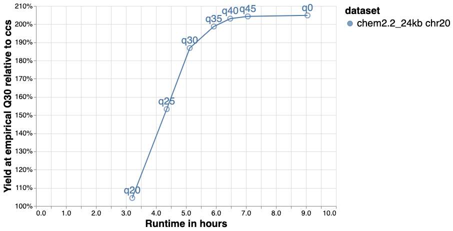

# Yield improvement versus ccs on various sequencing runs

## We evaluate on 3 different datasets

For each PacBio dataset (Movie ID), we compared yield at Q30 for ccs (baseline),
DeepConsensus v0.2, and DeepConsensus v0.3.

Movie ID             | Sample | Chemistry | Mean insert size
-------------------- | ------ | --------- | ----------------
m64011_181218_235052 | HG002  | 1         | 11 kb
m64008_201124_002822 | HG002  | 2.2       | 15 kb
m64014_200920_132517 | HG002  | 2.2       | 24 kb

## Yield versus runtime

<table border="1" class="dataframe">
  <thead>
    <tr style="text-align: right;">
      <th>version</th>
      <th>movie</th>
      <th>dataset</th>
      <th>num_reads_ccs</th>
      <th>num_reads</th>
      <th>yield@emQ20</th>
      <th>yield@emQ20/ccs</th>
      <th>yield@emQ30</th>
      <th>yield@emQ30/ccs</th>
      <th>yield@emQ40</th>
      <th>yield@emQ40/ccs</th>
      <th>hours</th>
    </tr>
  </thead>
  <tbody>
    <tr>
      <td>v0.3</td>
      <td>m64011_181218_235052</td>
      <td>chem1_11kb</td>
      <td>1,393,202</td>
      <td>1,533,357</td>
      <td>16.86 Gb</td>
      <td>108.74%</td>
      <td>11.16 Gb</td>
      <td>121.78%</td>
      <td>4.06 Gb</td>
      <td>167.33%</td>
      <td>301.46</td>
    </tr>
    <tr>
      <td>v0.3</td>
      <td>m64008_201124_002822</td>
      <td>chem2.2_15kb</td>
      <td>2,689,147</td>
      <td>2,864,910</td>
      <td>42.41 Gb</td>
      <td>106.09%</td>
      <td>30.41 Gb</td>
      <td>115.70%</td>
      <td>7.54 Gb</td>
      <td>191.51%</td>
      <td>739.09</td>
    </tr>
    <tr>
      <td>v0.3</td>
      <td>m64014_200920_132517</td>
      <td>chem2.2_24kb</td>
      <td>1,919,192</td>
      <td>2,064,266</td>
      <td>48.99 Gb</td>
      <td>107.02%</td>
      <td>27.64 Gb</td>
      <td>149.24%</td>
      <td>1.60 Gb</td>
      <td>462.97%</td>
      <td>1,003.86</td>
    </tr>
  </tbody>
</table>

`yield@emQ30/ccs` or "Yield at empirical Q30 relative to CCS" is calculated as
follows:

1.  Filter DeepConsensus output to predicted Q20.
2.  For each read, align it to the truth and calculate identity from that
    alignment: identity = # matches / (# matches + # mismatches + #
    insertions + # deletions).
3.  Take all the reads that have identity >= 0.999 (this is Q30).
4.  Because longer reads are more useful than shorter reads, we count the total
    bases and not just the number of reads.
5.  Next we repeat the above for the original CCS reads (run with default
    params = Q20 filtered) and subtract and divide them to get a percentage,
    e.g. 40% percent means that DeepConsensus increased yield of high quality
    reads in bases by 40% over CCS.

These were run on GCP `n1-standard-32` machines with no GPU (in 500 shards,
combined above), with `--batch_zmws=500 --batch_size=1024`. However, in our
runtime tests we find that using `n1-standard-16` VMs with `--batch_zmws=100
--batch_size=1024` has similar runtime with fewer CPUs and memory needed. For
more information on compute setups, see the
[runtime metrics page](runtime_metrics.md).

## Runtime-yield tradeoffs with `--skip_windows_above`

The `--skip_windows_above` option (new in v0.3) allows DeepConsensus to skip
windows whose average CCS base qualities are already above a certain quality
threshold. The windows that are skipped just adopt the CCS sequence without
correction. This saves runtime, but there is a yield tradeoff, shown in this
chart for m64014_200920_132517-chr20:

.

The default in v0.3 is Q45, but you can adjust this level using
`--skip_windows_above`.
